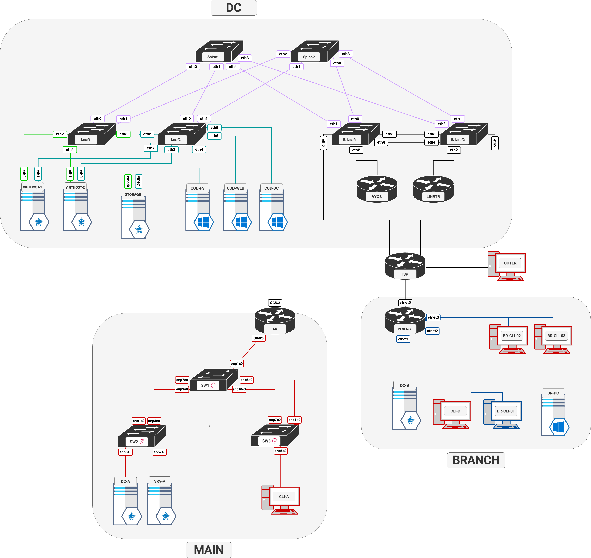
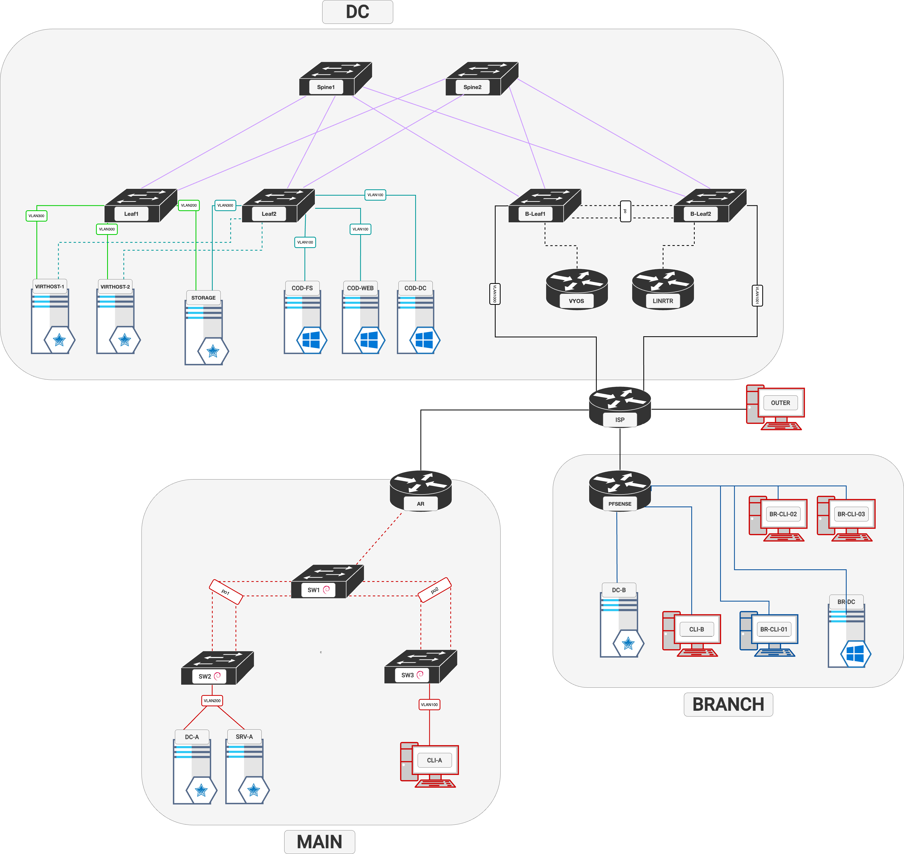

# Конкурсное задание

## Компетенция «Сетевое и системное администрирование»

**Версия 2.10 от 09.03.2025**

Общее время на выполнение конкурсного задания: **15** часов

### ВВЕДЕНИЕ

Данное конкурсное задание содержит множество задач, основанных на опыте реальной эксплуатации информационных систем в сфере интеграции и аутсорсинга корпоративных вычислительных сетей.

### ОПИСАНИЕ КОНКУРСНОГО ЗАДАНИЯ

Данное конкурсное задание разработано с использованием различных технологий, входящих в сертификационные программы LPIC, Red Hat, CCNA, CCNP, MCSA и др.  
Совместное использование этих технологий представляет собой достаточно сложную инфраструктуру. Требования в задании представлены в общем виде, конкретный метод выполнения и технологии, необходимые для его реализации, вы вправе выбрать самостоятельно с учётом указанных в задании требований.  
Можно заметить, что многие технологии должны работать в связке или поверх других. Например, динамическая маршрутизация должна выполняться поверх настроенного между организациями туннеля. Важно понимать, что если вам не удалось настроить полностью технологический стек, то это не означает что работа не будет оценена. Например, для удаленного доступа необходимо настроить IPsec-туннель, внутри которого организовать GRE-туннель. Если вам не удалось настроить IPsec, но вы смогли настроить GRE, то вы все еще получите баллы за организацию удаленного доступа.
Главной задачей является получение работоспособной системы в том или ином виде, а также её ежедневная доработка и улучшение.

### СХЕМА ОЦЕНКИ

Оцениваемые аспекты имеют разный вес в зависимости от их сложности. Схема оценки построена так, чтобы каждый аспект оценивался только один раз. Например, в задании предписывается настроить корректные имена для всех устройств, данный аспект будет оценен только один раз и повторная оценка данного аспекта проводится не будет. Одинаковые пункты могут быть проверены и оценены больше чем 1 раз, если для их выполнения применяются разные настройки или они выполняются на разных классах устройств. Следует также учесть, что для данного задания возможна автоматическая оценка результатов. Проверка будет производиться с использованием доменных имен. Проверка по IP-адресам выполняться не будет.
Минимальные пороговые значения решения задания:
    - для студенчиской лиги: 30%
    - для основной лиги:    60%

### НЕОБХОДИМОЕ ОБОРУДОВАНИЕ, ПРИБОРЫ, ПО И МАТЕРИАЛЫ

Конкурсное задание выполнимо в полном объеме с привлечением оборудования и материалов, указанных в Инфраструктурном листе.

### ИНСТРУКЦИИ ДЛЯ УЧАСТНИКА

В первую очередь рекомендуется прочитать задание полностью. 
Следует обратить внимание, что задание составлено не в строгом хронологическом порядке. 
Для выполнения некоторых пунктов задания может потребоваться выполнение действий из других пунктов, которые изложены в задании ниже. 
Таким образом, порядок выполнения задания и распределение временных затрат определяется участниками самостоятельно.
Конкурсное задание имеет сквозную структуру, и предполагается, что вы продолжаете его выполнение на следующий день с того момента, на котором остановились в предыдущий. 
Вам доступно полное задание на все конкурсные дни.  
Рекомендуется тщательно проверять результаты своей работы. 
В частности, рекомендуется убедиться в полной работоспособности служб DNS для клиентских устройств.  
В последний конкурсный день, по завершению работы, все виртуальные машины должны быть выключены, затем участник сможет их включить в желаемом порядке. 
Сетевое оборудование будет перезагружено по питанию. Также рабочее место может быть выключено в ночное время.  
IP адресация в топологии выбирается на ваше усмотрение, за исключением адресов, предоставляемых провайдерами. 
Например, для сервера DC-A в сети MAIN вы может использовать адреса 172.16.10.156 или 192.168.0.12. 
Сохранение существующей адресации не требуется и не оценивается. 
Однако, вы должны самостоятельно убедиться, что разработанные вами схемы адресации соответствуют требованиям задания.  
Виртуальные машины могут иметь предустановленное программное обеспечение, которое будет применяться при проверке и оценке, его не рекомендуется удалять. 

- Для доступа к виртуальным Linux-машинам используйте логин root с паролем toor.  
- Для первого доступа к PFSENSE - логин admin с паролем pfsense
- Для первого доступа к AR - логит super с паролем super.
- При первом доступе к Windows-машинам следуйте инструкциям мастера. В любом случае на всех машинах обеспечьте работоспособность учетной записи: Administrator/P@ssw0rd с правами как локального, так и доменного администратора.

Если Вам требуется установить пароль, не указанный в задании, а также в инструкциях и файлах дополнений, используйте: P@ssw0rd  
Доступ к маршрутизатору ISP не предусмотрен. На всех устройствах логины и пароли отсутствуют, устройства имеют “нулевую” конфигурацию.  
Дополнительные материалы и дистрибутивы можно найти на ресурсе `http://files.atom25.ru`

OUTTER является служебной машиной, необходимой для доступа к документации. Данная машина оцениваться не будет. Для получения доступа к документации настройте на OUTTER адрес 12.12.12.100/24 с шлюзом 12.12.12.1 и адресом DNS 12.12.12.1.

### ПРЕДНАСТРОЙКИ РАБОЧЕГО МЕСТА

1.	На всех предустановленных Windows-машинах установлены гостевые дополнения для гипервизора.
2.	На всех Windows-машинах выполнена команда sysprep.
3.	Комплекты документации доступны на сервере files.atom25.ru, имитирующем реальную работу сети Интернет.
4.	Все сетевые устройства доступны по консоли. 
5.	Параметры интернет-провайдеров, предоставляющих услуги организации или клиентам.

    | Провайдер   | Адрес IPv4/Маска     | Шлюз IPv4         | AS    |
    | ----------- | -------------------- | ----------------- | ----- |
    | MOONET      | 172.217.35.80/24     | 172.217.35.1      | 15169 |
    | GIGAFON COD | 178.207.179.4/29     | 178.207.179.1     | 31133 |
    | GIGAFON A   | 178.207.179.28/29    | 178.207.179.25    | 31133 |
    | GOSTELECOM  | 77.34.141.141/22     | 77.34.140.1       | 12332 |

6.	Провайдеронезависимые (PI) адреса и ASN в ЦОДе

    | Адрес IPv4/Маска | Сеть   | AS    |
    | ---------------- | ------ | ----- |
    | 203.0.113.0/24   | COD    | 64500 |

7.	Адреса DNS

    |        | DNS |
    | ------ | ------- |
    | MOOGLE | 172.217.35.1 |
    | GIGAFON COD | 178.207.179.1 |
    | GIGAFON A | 178.207.179.25 |
    | GOSTELECOM | 77.34.140.1 |
    | OUTTER | 12.12.12.1 |

8.	В сетях MOONET и GIGAFON COD сделаны настройки BGP.
	1.	Соседство устанавливается по IPv4 с адреса шлюза на выделяемый провайдером адрес через физический интерфейс и указанные выше номера автономных систем.
	2.	Все провайдеры анонсируют делегируемые префиксы в “интернет”.
	3.	Провайдеронезависимый префикс не анонсируется.

9.	На DNS-сервере (все адреса ISP) настроена зона atom25.ru 
10.	На виртуальных машинах используются следующие версии ОС:

    | ОС              |    Название ВМ       |
	| --------------- | ------------------------------- |
 	| Astra Linux 1.7.5 |	DC-A, DC-B, SRV-A,|
    | Astra Linux 1.8.1 |  CLI-A, CLI-B       |
	| Debian 12       |	SW1, SW2, SW3, LINRTR |
 	| Windows Server 2025 GUI  | COD-DC, COD-FS, COD-WEB, BR-DC |
 	| VyOS 1.5-stream      |	VYOS, Leaf1-2, B-Leaf1-2, Spine1-2 |
 	| PFSENSE latest    |	PFSENSE |
    | Huawei AR     |	AR |

11. Таблица VLAN/VRF/VNI

| VLAN | Название     | L2VNI  | L3VNI | VRF |
| ---- | ------------ | ------ | ----- | ----------------- |
| 100  | WINDOWS      | 100100 | 1000  | INFRA             |
| 200  | INFRA        | 100200 | 1000  | INFRA             |
| 300  | MGMT         | 100300 | 1001  | MGMT              |
| 900  | RTR-INFRA    | -      | -     | INFRA             |
| 901  | RTR-MGMT     | -      | -     | MGMT              |

	
	> VLAN 1 - запрещено использовать только в сетях офисов. Запрет не распостраняется на сети ЦОД.

12. Все устройства должны доверять корпоративному центру сертификации на уровне системы, для работы утилит **curl** и **wget**. На клиентских ПК дополнительно необходимо обеспечить доверие к сертификату браузера **firefox** и почтового клиент **thunderbird**, для всех пользователей. **Все сервисы кроме Ald Pro, предусматривающие доступ через web браузер или почтовый клиент, должны быть защищены с использованием корпоративного центра сертификации.**

### Настройка сетевых устройств

1.  Настройте fqdn hostname (для ЦОД - *.atom25.local, для main (центральный) и branch (филиала) офисов - office.atom25.local и branch.atom25.local) на всех сетевых устройствах.

2.	Настройте административный доступ ко всем сетевым устройствам.
	1.	Используйте протокол SSH.
		- с компьютера CLI-A в центральном офисе не должно возникать ошибок при подключении к AR.
	2.	На AR используйте для аутентификации по SSH RADIUS-сервер (DC-A), но предусмотрите локальный вход в случае недоступности сервера.
		- RADIUS сервер должен использовать базу пользователей ALD office.atom25.local для аутентификации пользователей.
		- Пользователь radadmin с паролем radpass должен получать максимальные привилегии при входе по ssh. Пользователь не должен существовать локально.
	3.	Создайте учётную запись atom с защищённым паролем P@ssw0rdSkills и максимальными привилегиями на тех устройствах, где её ещё нет.
		* пользователь atom должен заходить консольно.
	4.	При входе в систему по SSH или через консоль с учётной записью atom пользователю должны автоматически передаваться максимальные полномочия.
	5.	На устройствах с ОС Debian предусмотрите доступ sudo без пароля.

3.	Настройте сетевые устройства согласно топологии L3.
	1.	Сконфигурируйте коммутаторы на базе OpenVSwitch согласно топологии L2.
	2.	Настройте IP-адреса интерфейсов управления с использованием NativeVLAN.
		- интерфейс управления на маршрутизаторе AR должен обрабатывать нетегируемый трафик.
	3.	Настройте IP-адреса на маршрутизаторе AR, выдаваемые провайдером.

4.	Настройте агрегацию между коммутаторами SW1, SW2, SW3.
	1.	Используйте протокол LACP.
	2.	Коммутатор SW1 должен инициировать согласование канала.
	3. 	Коммутаторы SW2 и SW3 - должны ожидать согласование, но не инициировать его.
	
5.	Настройте транки между коммутаторами SW1, SW2 и SW3 поверх агрегацию.
	1. На магистральных каналах только используемые VLAN.
	2. Для обработки трафика управления используйте NativeVLAN. Добавлять его в транк **запрещено**.

7.	Настройте синхронизацию времени между сетевыми устройствами по протоколу NTP.
	1.	В качестве сервера должен выступать сервер DC-A.
	2.	Все остальные устройства должны синхронизировать своё время с сервером DC-A.
	3.	Используйте на всех устройствах московский часовой пояс.

8.	Настройте мониторинг и журналирование конфигураций на всех сетевых устройствах.
	1.	Используйте SNMPv2c и строку сообщества atomskills2025.
	2.	Syslog уровня важности Error и более важные необходимо отправлять на сервер логирования.

9.	Настройте защищенные тунели между офисами и ЦОД.
	1.	Настройте GRE тунель между AR и VYOS.
    2. Настройте GRE туннель между PFSENSE и VYOS.
	3.	Защитите настроенные тунели при помощи IKEv2 IPSEC с использование PSK.
	4.	Используйте параметры согласования на свое усмотрение.

10.	Настройте динамическую маршрутизацию.
	1.	Используйте OSPF для маршрутизации между AR, PFSENSE и VYOS (внутри тунеля).
    2. Обеспечьте связанность между офисами и ЦОД.

12. В сети центра обработки данных сконфигурируйте интерфейсы согласно топологии.
    1. Между Spine-Leaf коммутаторами используйте L3 адресацию с маской /31.
    2. Настройте агрегацию каналов согласно схемы. Используйте протокол LACP.
    3. Для связанности с провайдером MOONET используйте тэг 1000.
    4. Для связанности с провайдером GIGAFON COD используйте тэг 1001.

13. Настройте loopback-интерфесы на Spine/Leaf коммутаторах.
    1. dummy0 используйте для Router-id и update-source. 
    2. dummy1 используйте для VTEP-source. 
    3. dummy2 используйте в качестве management интерфейсов. Интерфейсы должны находится в VRF MGMT на Leaf коммутаторах.

14. Обеспечьте Undarlay маршрутизацию в фабрике с использованием OSPF на Spine/Leaf коммутаторах:
    1. Используйте point-to-point на интерфейсах
	2. Укажите RID в явном виде. 
	3. Настройте Passive-interface default.
	4. Для OSPF adjacency должен быть настроен в GRT (глобальная таблица маршрутизации).
	5. Анонсируйте dummy-интерфейсы в OSPF.
	6. Используйте аутентификацию в OSPF, в качестве пароля используйте P@ssw0rd.

15. Настройте Overlay AFI EVPN L2VNI в VxLAN-фабрике для передачи L2 трафика поверх L3 сети. 
	1. Настроите BGP peering между Leaf и Spine коммутаторами в address-family evpn. 
	2. В качесвте AS VxLAN фабрики настрйоте номер 65101.
	3. Используйте iBGP, укажите RID в явном виде.
	4. Spine-уоммутаторы настройте в роли Route-reflector.
	5. Сконфигурируйте Leaf-коммутаторы в роли VTEP,  источником VxLAN тунелей должен выступать dummy1.
	6. Для каждого VLAN настройте VxLAN туннели с соответсвующим VNI в формате `100<номер VLAN>`.
	7. Обеспечьте передачу и хранение таблицы MAC-адресов L2VNI на Leaf-коммутаторах.
	8. Убдеитесь что Leaf коммутаторы получили по BGP маршруты type-2 с mac-адресами удалённых VTEP.

16. Настройте Overlay AFI EVPN L3VNI для возможности связи меджу VLAN внутри VRF.
	1. Настройте VRF согласно таблице. 
	2. Для каждого VRF настройте L3VNI с уникальным номером.
	3. На Leaf-коммутаторах настройте шлюзы по умолчанию для сетей в фабрике.
	4. Используйте статические anycast-шлюзы (SAG) по схеме **Distributed Gateway** (распределённый шлюз). 
	5. На каждом LEAF-коммутаторе для каждого VNI должен быть настроен SVI-интерфейс и назначен **одинаковый** IP-адрес, который будет служить адресом шлюза по умолчанию для локально подключенных клиентов.
	6. Убдеитесь что Leaf коммутаторы получили по BGP маршруты type-5 и связку macip с удалённых VTEP. Установились маршруты до клиентов с маской /32. 

17. Связь между VRF следует обсепечить через маршрутизаторы VYOS и LINRTR.
	1. Для каждого VRF настройте интеркоонект между Border Leaf, VYOS, LINRTR.
	2. Настроите BGP peering между Border Leaf коммутаторами и маршрутизаторами в address-family ipv4.
	3. В качесвте AS маршрутизаторов используйте 64500.
	4. Анонсируйте сети фабрики в сторону маршрутизаторов.
	5. Анонcсируйте маршрут по умолчанию по BGP от маршрутизаторов.

20. Настройте маршрутизаторы для обеспечения доступа в интернет для клиентов локальных сетей.
	1. Настройте NAT для адресов зон INFRA и MGMT.
        * Анонсировать внутренние сети ЦОД в провайдера запрещено.
	2. В качестве основного канала для выхода в интернет используйте провайдер MOONET, при падении основного канала - используйте GIGAFON.
    3. Настройте iBGP между маршрутизаторами, используйте vlan 999 для взаимодействия.
        * Передача данных должна происходить через bond интерфейс между border leaf коммутаторами.

### Настройка сервисов ОС Linux в сети центрального офиса

1. Разверните службу аутентификации на базе ALD Pro, используйте доменное имя office.atom25.local.
    1. В качестве сервера используйте DC-A.
    2. Мигрируйте учетные записи и группы из Windows домена atom25.local.
    3. В качестве DNS-сервера и DHCP-сервера используйте DC-A. Реализуйте обратные записи для всех подсетей офиса.
        * Реализуйте DDNS - Записи автоматически добавляются в прямые, а также в обратные зоны.
		* При использовании статического адреса на клиенте, он также должен быть добавлен в DNS.
2. CLI-A должен аутентифицироваться через ALD Pro.
    1. Разрешите пользователям, входящим в доменную группу core-web-admins, повышать привилегии с использованием команды sudo без указания пароля пользователя.
    2. При использовании команды sudo для пользователей из доменной группы core-wd-admins не должен запрашиваться пароль при вводе команд, начинающихся с apt и dmesg.
    3. У других доменных пользователей не должно быть прав на повышение привилегий с использованием команды sudo.
3. Реализуйте перемещаемые профили только для доменных пользователей на сервере SRV-A.
    1. Используйте протокол NFS версии 4.
    2. При входе на другом компьютере пользователь должен получать доступ ко всем своим данным.
    3. Обеспечьте синхронизацию каталогов профилей пользователей между офисами.
	4. Синхронизация каталогов не должна занимать более 30 секунд.
4. Реализуйте общие каталоги только для доменных пользователей на сервере SRV-A, используя NFS.
    1. Каталог Share: все пользователи имеют права для чтения и записи в данный каталог. При этом, удалять файлы из этого каталога могут только владельцы файлов.
    2. Каталог Docs: доступ для чтения и записи имеет только группа core-web-admins. Остальные пользователи имеют доступ в формате read only.
	3. Каталог Secret: Данный каталог должны получать только пользователи, входящие в группу core-wd-admins. Остальные пользователи не должны видеть данный каталог на рабочем столе.
    4. Все общие каталоги необходимо смонтировать на рабочий стол.
5. На SRV-A реализуйте почтовый сервер.
    1. Соединение с почтовым сервером должно быть защищено. Клиент не должен получать ошибок в почтовом клиенте.
    2. Обеспечьте аутентификацию с использованием доменных учетных данных.
        * В качестве домена используйте office.atom25.local.
    3. Обеспечьте возможность отправки писем. От имени пользователя aarozhkov на CLI-A отправьте письмо пользователю emsmirnova на CLI-B.
    4. При входе пользователь должен указывать только логин учетной записи и почтовый домен в формате username@office.atom25.local. 
		* Почтовый клиент не должен требовать ввода данных почтового сервера и пароля.
			> - Клиент не должен запрашивать никаких данных про сервера.
			> - Авторизация должна проходить по билету kerberos.

6. На SRV-A сконфигурируйте прямой прокси сервер SQUID
    1. Сконфигурируйте клиентов офиса branch для использования данного прокси-сервера при доступе к ресурсам для всех пользователей домена. Необходимо обеспечить использование прокси только браузером Firefox, причём настройка должна применяться для всех пользователей, в том числе и доменных.
    2. Доступ должен быть разрешен ко всем внутренним ресурсам предприятия.
    3. Настройте ограничения доступа к прокси-серверу и размещенным на ISP сайтам:
        * Пересылку трафика через SQUID должны иметь возможность осуществлять только клиентские хосты филиала.
        * Доступ к сайту site2.atom25.ru должен быть ограничен для всех клиентских хостов филиала
        * Доступ к сайту site1.atom25.ru должен предоставляться только после авторизации по логину и паролю. Используйте локальную базу данных пользователей.
        * Пользователь ivan с паролем P@ssw0rd должен иметь возможность загрузки файлов с сайта site1.atom25.ru без каких-либо ограничений скорости.
        * Пользователю aleksey с паролем P@ssw0rd должна быть ограничена скорость загрузки файлов расширений .mp4 и .png с сайта site1.atom25.ru.  Установите скорость 10 байт/сек.

### Настройка сервисов ОС Linux в сети офиса филиала

1. Разверните контроллер системы управления ЕПП на базе ALD Pro для домена branch.atom25.local. 
    1. В качестве сервера используйте DC-B.
    2. В качестве DNS-сервера используйте DC-B. Реализуйте обратные записи для всех подсетей офиса.
    3. Сконфигурируйте двусторонние отношения доверия с доменом office.atom25.local. Пользователи домена office должны иметь возможность аутентификации в домене branch.
    4. Пользователи, прошедшие аутентификацию через отношения доверия должны автоматически получать kerberos билет.
	5. Создайте группы restricted_login и restricrted_console. Создайте пользователей bruser1 и bruser2. Добавьте их в группы restricted_login и restricted_console соответственно.
2. CLI-B должен аутентифицироваться через ALD Pro.
    1. Для пользователей из доменной группы admins при входе на рабочем столе должны создаваться ярлыки на web интерфейс Zabbix и ALD Pro.
    2. Ограничить консольный доступ для пользователей из доменной группы restricted_console.
    3. Запретить вход пользователей состоящих в доменной группе restricted_login.
3. Реализуйте перемещаемые профили только для доменных на сервере DC-B.
    1. Используйте протокол NFS версии 4.
    2. При входе на другом компьютере пользователь должен получать доступ ко всем своим данным.
    3. Обеспечьте синхронизацию каталогов профилей пользователей между офисами.
	4. Пользователя домена office должны иметь полный доступ к своим данным
4. Реализуйте общие каталоги только для доменных пользователей на сервере DC-B.
    1. Все общие каталоги необходимо смонтировать на рабочий стол.
    2. Обеспечьте синхронизацию общих каталогов между офисами.

### Настройка сервисов в ЦОД

1. На серверах VIRTHOST-1 и VIRTHOST-2 разверните систему виртуализации на ПО Libvirt.
    1. Для хранения дисков виртуальных машин создайте пул AS25-Storage. Используйте NFS хранилище на ВМ Storage.
	2. Трафик виртуальных машин не должен быть подвергунт модификации при передаче во внешние сети.
2. Cоздайте виртуальные машины на базе ОС Astra Linux: CLOUD-INFRA, CLOUD-MON и CLOUD-PROD на хостах VIRTHOST-1 и VIRTHOST-2 соответственно.
`Образ диска виртуальной машины находится на ресурсе files.atom25.ru`
    1. Для виртаульной машины CLOUD-INFRA используйте:
        * CPU: 4 core 
        * RAM: 8 GB
    2. Для виртаульной машины CLOUD-PROD используйте:
        * CPU: 4 core
        * RAM: 8 GB
    3. Для виртаульной машины CLOUD-MON используйте:
        * CPU: 4 core
        * RAM: 8 GB

3. На NAS сервере cоздайте дисковый пул «nfs» в режиме stripe.
	1. На дисковом пуле «nfs» создайте nfs ресурс.
	2. Виртуальные машины CLOUD-INFRA, CLOUD-PROD, CLOUD-MON должны располагаться в созданном каталоге.
    3. Доступ до интерфейса NAS должен происходить по mgmt vlan.

4. На виртуальной машине CLOUD-INFRA разверните сервис SSO на базе Keycloak версии 23.0.3.
   1. В качестве сервера СУБД используйте развёрнутый на CLOUD-INFRA PostgreSQL.
   2. Обеспечьте доступ пользователю **admin** с паролем P@ssw0rd в интерфейс управления Keycloak.
   3. Keycloak должен быть доступен по адресу https://kc.atom25.local:8443.
   4. Сконфигурируйте REALM **ATOM25** следующим образом:
      1. Настройте взаимодействие Keycloak с КД ALD Pro office.atom25.local по протоколу LDAP в режиме READ_ONLY. Перенесите пользователей (и только пользователей) из ALD Pro в Keycloak.
      2. Токен обновления JWT должен использоваться для обновления **только один раз**.
      3. Срок действия токена доступа должен быть ограничен двумя минутами.
      4. Настройте отображение надписи "ATOMSKILLS 2025" на странице с формой входа.
      5. Создайте локальные группы Managers, Interns и настройте их следующим образом:
         - В группу Managers включите пользователей core-web-admins. Добавьте атрибут **OU** со значением «Finance Department»;
         - В группу Interns включите пользователей core-wd-admins. Добавьте атрибут **OU** со значением «Control Department»;
      6. Назначьте пользователям dygorshkova, easazonov, ebafanasev роль «Chief» клиента.
	
5. Разверните Корпоративное приложение на виртуальной машине CLOUD-PROD
   1. В качестве оркестратора необходимо использовать Docker Compose. Разместите docker-compose.yml в директории **/opt/eapp**
   2. Образы компонентов приложения необходимо получать из корпоративного GitFlic Container Registry.
   3. Backend-компонент должен быть доступен по адресу https://app-backend.atom25.local. Допускается использование портов, отличных от стандартных.
   4. Приложение должно быть доступно по адресу https://app.atom25.local.
   5. Запрещено изменять исходный код приложения (файлы конфигураций не считаются исходным кодом).
   6. Выполните интеграцию приложения с сервисом SSO Keycloak. 
      1. Используйте протокол OpenID Connect.
      2. Используйте созданный ранее REALM **ATOM25**.
      3. К «Панели администратора» (ресурс admin) должен быть доступ только у пользователя zudrozdov; 
      4. К «Панели оператора» (ресурс operator) должны иметь доступ только те пользователи, у которых указан атрибут OU со значением «Control Department»; 
      5. К «Конфиденциальной информации» (ресурс confidential) должны иметь доступ только пользователи с ролью «Chief» клиента.
   7. HTTP-сервер frontend-компонента приложения должен добавлять заголовок "Servername" в HTTP Response со значением имени хоста, на котором он запущен. 
   8. Обеспечьте автоматическое перенаправление на https при подключении к приложению.

6. Выполните настройку CI/CD для Корпоративного приложения
   1. Установите на виртуальную машину CLOUD-INFRA платформу для работы с кодом GitFlic. 
   2. Зарегистрируйте пользователя **Devops Master** в сервисе на почтовый адрес devops@atom25.ru. В качестве пароля используйте P@ssw0rd.
   3. GitFlic Runner должен быть сконфигурирован в режиме Docker и быть запущен на CLOUD-MON.
   4. Исходный код Корпоративного приложения необходимо разместить в репозитории **eapp**. Devops Master должен иметь полный доступ к указанному репозиторию. 
   5. Компоненты приложения должны упаковываться в образы контейнеров Docker и отправляться в корпоративный GitFlic Container Registry по окончании сборки.
   6. Перед сборкой образа контейнера backend-компонента необходимо анализировать код файла unittest.py модулем pycodestyle и выполнять тестирование кода модулем pytest. Тесты для pytest описаны в unittest.py.
   7. Приложение (и только само приложение) должно конфигурироваться в процессе CI/CD. Не допускается использование заранее подготовленных файлов конфигурации config.json и/или .env, а также явное указание значений в Pipeline.
   8. Pipeline должен обеспечивать возможность запустить процесс сборки и развёртывания backend и frontend компонентов как по отдельности, так и совместно в ручном режиме. Причём развёртывание должно осуществляться **строго** после сборки образов и запускаться автоматически.
   9. Pipeline должен использовать Downstream для процессов сборки образов компонентов backend и frontend.
   10. Развёртывание новых версий компонентов приложения должно выполняться на виртуальной машине CLOUD-PROD. В процессе обновления одного компонента остальные компоненты должны оставаться в работе. 
   11. Веб-интерфейс сервиса GitFlic должен быть доступен по адресу https://git.atom25.local.
   12. Запрещено изменять исходный код приложения (файлы конфигураций не считаются исходным кодом).

6. На виртуальной машине CLOUD-INFRA разверните СУБД postgresql. Все сервисы предприятия, для работы которых необходимо подключение к базам данных должны использовать СУБД на данном сервере. 
    1. Для postgresql создайте следующих пользователей:
        * superadmin - Суперпользователь.
        * zabbix_user - Пользователь для подключения Zabbix.
        * gitflic_user - Пользователь для подключения Gitflic.
        * kc_user - Пользователь для подключения к KeyCloack
    2. Используйте пароль P@ssw0rdSkills для каждого пользователя. Все создаваемые пользователи должны иметь доступ только к тем базам данных, которые им необходимы.Суперпользователь должен иметь полный доступ ко всем базам данных.

7. На виртуальной машине CLOUD-MON реализуйте централизованный сбор журналов. 
    1. Журналы необходимо собирать с устройств DC-* NFS SRV-A уровень сообщений не ниже ERROR.
    2. Настроить запись журналов в файлы /opt/logs/hostname.log
    3. На CLI-* настроить сбор журнала всех команд, вводимых в терминале только для доменных пользователей. Настроить запись журналов в директорию /opt/logs/hostname.log на сервере CLOUD-MON.
        * Журнал должен использовать тег bash-history и формат сообщения login=имя_пользователя cwd=рабочая_диретория filename=путь_до_команды cmdline=команда.
        * Настройте ротацию логов: при достижении объема в 1МБ журнал следует сжимать.
        * Необходимо хранить до 2 версий архивных журналов. Выполнять ротацию следует раз в минуту.
        * Сконфигурируйте web сервер для доступа к файлам журналов на CLOUD-MON по адресу: `https://logs.atom25.local`.
        * Настройте пернаправление с http на https.

8. На виртуальной машине CLOUD-MON реализуйте службу мониторинга zabbix.
    1. Для административного доступа создайте локальную учётной запись zabbixadmin с паролем P@ssw0rdSkills.
    2. Следует мониторить сетевые устройства AR VYOS PFSENSE LINRTR используйте протокол SNMP. Для сбора метрик используете встроенне в Zabbix шаблон подходящий под сетевые устройства. Для AR и PFSENSE строить график icmp response time.
    3. Следует мониторить сервера DC-* SRV-A CLOUD-* и все Windows-серверы при помощи Zabbix agent. Для сбора метрик используйте встроенный в Zabbix шаблон мониторинга ОС Linux.
        * Соединение с Zabbix agent должно быть защищено с использованием pre-shared key.
        * Настроить автообнаружение хостов с периодичностью запуска - 10 минут.
        * Для автообнаружения используйте vlan INFRA.
    4. Для мониторинга сетвых устройств создайте дэшборд Network Devices.
        * Выведите график времени ответа устройства по icmp для каждого из устройств.
        * Выведите количество доступных сетевых устройств (Host availability).
    5. Для мониторинга серверов создайте дэшборд Servers.
        * Выведите графики утилизации памяти и процессорного времени для каждого из устройств.
    6. Веб интерфейс Zabbix должен быть доступен по адресу: https://zabbix.atom25.local.
        * Настройте пернаправление с http на https.

9. На виртуальной машине CLOUD-INFRA разверните корпоративный репозиторий.
    1. Репозиторий должен быть подписан gpg ключом. Используйте тип ключа RSA, длина 4096 и срок действия 36 месяцев.
    2. Подключите корпоративный репозиторий по записи `deb https://repo.atom25.local atom25 atom25-apps` на CLI-*.
    3. При вводе команды apt update не должно возникать предупреждений безопасности. Использование дополнительный параметров конфигурации файла sources.list не допускается.
    4. На сервере CLOUD-INFRA установить пакет lintian.
    5. Выполните установку пакета на CLI-A, на CLI-B подключите репозиторий, но установку пакета не выполняйте.

10. Создайте deb пакет с именем atom25-config. Deb пакет при установке должен выполнять следующие настройки:
    1. Устанавливать Zabbix agent и создавать все необходимые настройки для подключения к zabbix серверу.
    2. Разрешать доступ по ssh только для пользователей доменной группы admin, если сервер не доменный то разрешить доступ только для пользователя atomssh пароль P@ssw0rdSkills. Обеспечить доступ по порту 31337.
    3. При удалении пакета все внесенные изменения в конфигурационные файлы должны откатываться на файлы по умолчанию.
    4. Собранный пакет должен проходить проверку lintian без сообщений уровня Error.
    5. Добавть пакет корпоротивный репозиторий.

 
### Windows-инфраструктура
#### Описание предустановленной Windows-инфраструктуры
Список серверов и АРМов:

|**Имя сервера**|**DNS-имя**|**ip-адрес**|**Операционная система**|
| :-:  | :-: | :-: | :-: |
|COD-DC|COD-DC|192.168.100.1|Windows Server 2025 GUI|
|COD-FS|COD-FS|192.168.100.2|Windows Server 2025 GUI|
|COD-WEB|COD-WEB|192.168.100.3|Windows Server 2025 GUI|
|BR-DC|BR-DC||Windows Server 2025 GUI|
|BR-CLI-01|BR-CLI-01||Windows 10 LTSC|
|BR-CLI-02|BR-CLI-02||Astra Linux|
|BR-CLI-03|BR-CLI-03||Astra Linux|

Предустановленные учетные записи на Windows-машинах:

|**Имя сервера**|**Учетная запись**|**Пароль**|
| :-: | :-: | :-: |
|COD-DC|atom25\administrator|P@ssw0rd|
|COD-FS|atom25\administrator|P@ssw0rd|
|COD-WEB|atom25\administrator|P@ssw0rd|
|COD-DC|atom25\administrator|P@ssw0rd|
|BR-CLI-01|admin|P@ssw0rd|

Таблица с DNS-записями:

|**№**|**DNS-запись**|**Тип записи**|**IP-адрес**|
| :-: | :-: | :-: | :-: |
|1|cloud-infra|A, PTR|CLOUD-INFRA|
|2|cloud-prod|A, PTR|CLOUD-PROD|
|3|cloud-mon|A, PTR|CLOUD-MON|
|4|virthost-1|A, PTR|VIRTHOST-1|
|5|virthost-2|A, PTR|VIRTHOST-2|
|6|storage|A, PTR|STORAGE|
|7|pki|CNAME|COD-WEB|
|8|adfs|CNAME|COD-WEB|
|9|rds|CNAME|COD-WEB|
|10|cep|A|сервер на выбор|
|11|welcome|CNAME|COD-WEB|
|12|logs|CNAME|CLOUD-MON|
|13|git|CNAME|CLOUD-INFRA|
|14|kc|CNAME|CLOUD-INFRA|
|15|app|CNAME|CLOUD-PROD|
|16|zabbix|CNAME|CLOUD-MON|
|17|repo|CNAME|CLOUD-INFRA|
|18|nfs|CNAME|STORAGE|

На сервере **COD-DC** развернута служба каталогов с доменом **atom25.local**.
В домене создана структура OU для выполнения задания.
В домене созданы порядка 100 пользователей с паролем **P@ssw0rd**, которые распеределены по группам безопасности:
- core-wd-admins
- core-web-admins
- core-fs-admins
- core-putty-users
- core-rds-users
- core-fs-users
- core-fs-exchange-users

### Задание для Windows-администратора

#### Инфраструктура
1. Создайте AD-сайт с именем **branch** для дополнительного офиса;
2. Настройте привязку подсетей и установите репликацию между сайтами в **15 минут**;
3. Настройте динамическую выдачу ip-адресов и настроек в офисе Branch;
4. Разрешите ввод компьютеров в домен только пользователям группы **atom25\core-wd-admins и администраторам домена**;
5. Настройте помещение всех компьютеров по умолчанию в **OU=Computers,OU=Branch,OU=atom,DC=atom25,DC=local**;
6. Введите все серверы в домен и поместите их в **OU=servers,OU=core,OU=atom,DC=atom25,DC=local** кроме **BR-DC**;
7. Настройте контроллер домена **BR-DC** в дополнительном офисе и подвяжите его к сайту **Branch**, после чего введите все клиентские машины в домен кроме **BR-CLI-03**. Настройте приоритетное разрешение имен внутри офиса на данном контроллере домена для клиентов и всех серверов;
8. Добавьте учетные записи из файла **wdadmins.csv** в группу **atom25\core-wd-admins**, а пользователей **full-admins.csv** в группу **atom25\core-fs-admins** и **atom25\core-web-admins**;
9. Настройте **LAPS** для управления паролем локального администратора **winadmin** на клиентских машинах и исключите локальную УЗ **admin** из группы администраторов. Сделайте так, чтобы настройка LAPS применялась автоматически на все новые Windows-клиенты в домене;
10. Настройте парольную политику для группы **atom25\core-wd-admins**, чтобы она удовлетворяла следующим требованиям безопасности:
  - Минимальная длина пароля - **14 символов**;
  - Наличие спец.символов, разный регистр;
  - Смена пароля раз в **14 дней**;
  - Минимальное время для смены пароля - **1 день**;
  - Число запоминаемых паролей - **30**;
  - УЗ должна блокироваться после **5 неудачных попыток**, разблокировать УЗ может **только администратор**;
  - Сброс попыток между вводами паролей через **3 минуты**;
  - Имя политики **wdadmins_password_settings**.
11. Включите расширенный **аудит входа в систему**, в котором будут события по успешному и неуспешному входу в систему, а также события блокировки. Создайте отдельный журнал по этим событиям с именем **Users Audit** на домен-контроллере **COD-DC**. Используйте события с номерами 4624, 4625, 4648, 4634, 4647 и 4740;
12. Выполните настройки DNS на **COD-DC**:
  - Настройте условную пересылку запросов к домену **atom25.ru** на ISP;
  - Создайте необходимые записи и PTR-зоны согласно таблице DNS.
13. Мигрируйте пользователей домена **atom25.local** из **OU=Users,OU=Branch,OU=atom** в домен **office.atom25.local**;
14. Синхронизируйте время домен-контроллера с **ISP** и убедитесь, что доменные устройства отображают корректное время;
15. Установите **Zabbix агент** на **все серверы** и настройте мониторинг этих серверов.
   
#### Центр сертификации
1. Разверните корневой корпоративный центр сертификации на машине **COD-WEB** с параметрами:
   - Имя центра сертификации **WinAtom-RootCA**;
   - Срок действия сертификата - **4 года**;
   - Срок публикации основной CRL - **4 дня**.
2. Создайте веб-сайт с именем **pki.atom25.local** и опубликуйте в его корне ссылки на **CRL, deltaCRL и AIA** с возможностью скачивания;
3. Распространите корневой сертификат на все компьютеры домена **atom25.local** и на все устройства, где планируется использовать сертификаты, выпущенные данным ЦС;
4. Создайте следующие **шаблоны сертификатов** со свойствами:
	- **Web Site** - срок действия 1 год, экспортируемый ключ, должен быть разрешен выпуск сертификату машине **COD-WEB**;
	- **Web Admin Access** - срок действия 1 год,  должен быть разрешен авто и ручной выпуск пользователям, состоящим в группе **atom25\core-web-admins**.
5. Выпустите все необходимые сертификаты по заданию;
6. В домене разверните CEP роль сервера центра сертификации на любом удобном сервере:
	- Настройте доступ к нему по адресу **https://cep.atom25.local/<…>**;
	- Авторизация на сервере должна проходить средствами **Kerberos**;
	- Отображаемое имя - **CEP Atom 25**;
	- Настройки CEP должны распространяться на все Windows-компьютеры домена;
7. Обеспечьте выдачу сертификата с использованием CEP и шаблона **Computer**. При запросе сертификата через оснастку **MMC** можно выбрать этот CEP и можно выпустить сертификат;

#### Файловые службы
На сервере **COD-FS** настройте файловые службы:

1. Соберите **зеркальный** **RAID-массив** из двух подключенных дисков по **5 Гб** с **меткой S** и именем **Shared**;
2. Создайте иерархию каталогов внутри диска **S** с помощью скрипта **make_folders.ps1**, расположенном на **дополнительном диске**, либо в каталоге **\\COD-DC\share**;
3. Опубликуйте **DFS** по адресу **AtomDFS** и добавьте следующие каталоги с необходимыми правами доступа:
   - Папка обмена - Exchange-Folder, права на чтение и запись для всех пользователей группы **atom25\core-fs-exchange-users** и полные права для группы **atom25\core-fs-admins**;
   - Общие ресурсы - Shared-Resources, права только на чтение и запись, но с запретом на удаление, для всех пользователей группы **atom25\core-fs-users** права на полное редактирование для группы администраторов **atom25\core-fs-admins**.
4. Настройте **запрет на выкладывание** исполняемых **.exe** файлов в **Папку обмена**, а также файлов с расширениями **.mp4, .bat и .cmb**;
5. Создайте **домашние каталоги** для пользователей, настройте автоматическое подключение и права доступа таким образом, чтобы каждый пользователь мог видеть только свои каталоги;
6. Установите **жесткую квоту** каждому пользователю на его папку в **300 мбайт**;
7. Настройте **аудит доступа к папкам и файлам** для каталога **Папка обмена**. Должны записываться события доменных пользователей только на удаление файлов и папок.

#### Службы WEB-серверов
Создайте веб-сайт на сервере **COD-WEB**:

1. Сайт должен быть доступен только по **https** по доменному имени **welcome.atom25.local** и прикрыт **сертификатом**, выданным корпоративным ЦС. Контент для веб-сайта расположен на дополнительном диске в каталоге **welcome_site**;
2. Настроить доступ к **https://welcome.atom25.local/config** через сертификаты, выдаваемые автоматически для группы **atom25\core-web-admins** при включении в данную группу
3. У пользователей, не состоящих в данной группе, доступа к раздела конфигурации быть не должно;
4. При отсутствии доступа к разделу **https://welcome.atom25.local/config** должна выдаваться страница с текстом - **"Доступ запрещён!"**;
5. Установите на **COD-WEB** роль ADFS с именем **adfs.atom25.local** и включите возможность **смены пароля** пользователям домена **atom25.local**.

#### Служба удаленных рабочих столов
Разверните службу **RDS** на сервере **COD-WEB** и опубликуйте приложения:

1. Веб-портал должен быть доступен по адресу **rds.atom25.local** и защищён сертификатом, при этом должно работать перенаправление с **http на https**;
2. Установите на сервер приложение **Putty**;
3. Создайте коллекцию **AtomSkills Applications** для пользователей группы **atom25\core-rds-users** и опубликуйте для всех пользователей браузер **MS Edge**, а для пользователей группы **atom25\core-putty-users - **Putty**. Пользователей в группу необходимо импортировать из файла **putty_users.csv**;
4. При подключении по вебу на клиентских Windows-машинах не должны запрашиваться логин и пароль и возникать какие-либо сообщения и ошибки;
5. Обеспечьте запуск RDP-сессии без ввода логина и пароля. При подключении не должно выдаваться никаких ошибок и предупреждений (на предупреждение безопасности при скачивании RDP файла не распространяется)
6. Разрешите подключение к порталу RDS только из пользовательских подсетей всех офисов, а также из серверных Windows-сетей.

#### Групповые политики
С помощью GPO примените следующие параметры на клиентские устройства:

1. Настройте подключение **сетевого диска DFS** только доменным пользователям на клиентских машинах Windows с именем **Общий диск** и меткой **S**;
2. Настройте стартовую страницу браузера **MS Edge** на https://welcome.atom25.local для доменных пользователей;
3. Отключите для всех пользователей, в том числе и локального администратора **winadmin**, стартовый экран настройки MS Edge;
4. Пользователям группы **atom25\core-wd-admins** установите фоновую картинку **admin-wallpapers.jpg**, расположенную на дополнительном диске;
5. Добавьте группу **atom25\core-wd-admins** в группу **локальных администраторов** клиентских Windows;
6. Распространите на все клиентские Windows-компьютеры следующие ярлыки:
   - Смена пароля через ADFS - с именем **Сменить пароль**
   - Сайт www.files.atom25.ru - с именем **Репозиторий Atom 25** и иконкой **atomskills.ico**
   - Портал RDS - с именем **RDS-приложения** и иконкой **rds.ico**
    
## По завершению конкурсного дня

- В конце рабочего дня будет необходимо выключить виртуальные машины по указанию от экспертов.
- Включать виртуальные машины можно только по указанию от экспертов. 
- После завершения выполнения задания будет проведена проверка результатов.
- **Проверка будет выполняться исключительно по доменным именам.**
- В случае, если устройство или виртуальная машина недоступны по какой-либо причине (не подходят учётные записи, оговоренные в задании, нет сетевой связности), дальнейшая проверка этого устройства не проводится.

## Схема L1

## Схема L2

## Схема L3

